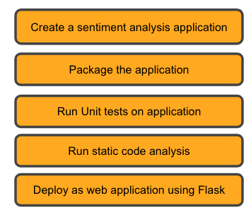

## Highlight
```
spaCy, Flask, unit test, static code analysis
```

## Overview

In this project, we make use of the spaCy, to create an application that would perform sentiment analysis on a provided text. We then deploy this application over the web using Flask framework.

## Main Steps

<div align = "center">

</div>

