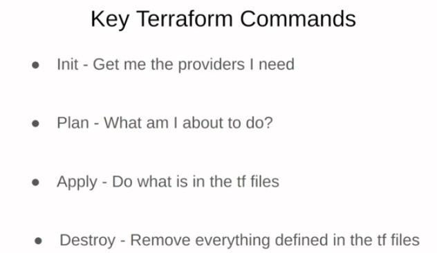

I am currently reskill myself on data engineeing, resource maily from Data Engineering Zoomcamp offered by DataTalks.Club. I summarize all by deploying a simple data engineering project.

The tools used and the role of the tools for the data engineering pipeline summarzie in Figure below.

## Week 1: Introduction & Prerequisites
Tech: Docker, Postgres, Google Cloud Platform (GCP), Terraform
Focus: Week 1 is dedicated to setting up the key tools and technologies you’ll be using throughout the course.
Local Part: Learn to package your application and its dependencies with Docker and run a fully functioning database using PostgreSQL.
Cloud Part: Discover Google Cloud Platform and Terraform, focusing on automating the setup and management of your cloud architecture.

1. Docker
2. PostgreSQL/PgAdmin/SQL
3. Terraform : infrastructure as code tool - resource management

4. Setup Google Cloud Platform(GCP)
5. GIthub Codeplaces

